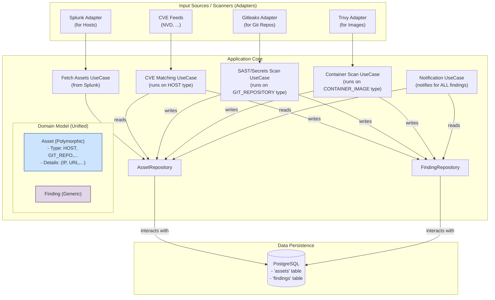

# VulnSense

[](https://golang.org)
[](https://opensource.org/licenses/MIT)

VulnSense is a modern vulnerability management platform designed with a flexible, polymorphic asset model and a robust background job processing system. It follows Clean Architecture and Domain-Driven Design principles to create a scalable and maintainable solution for tracking vulnerabilities across diverse asset types, from infrastructure hosts to source code repositories.

## Key Features

*   **Polymorphic Asset Model**: Manage different types of assets (e.g., `Host`, `GitRepository`) through a unified `Asset` entity using a `JSONB` data store.
*   **Clean Architecture**: Separation of concerns with distinct layers for domain, use cases, and adapters, ensuring high cohesion and low coupling.
*   **Background Job Processing**: Utilizes a powerful worker-scheduler pattern with `Asynq` and Redis for reliable, scheduled, and asynchronous task execution.
*   **Separated Worker & Scheduler**: The application is split into two distinct processes: a `scheduler` to enqueue tasks and a `worker` to execute them, allowing for independent scaling.
*   **Database Migrations**: Managed via `golang-migrate` for version-controlled schema changes.
*   **Configuration Management**: Flexible configuration loading from files and environment variables using `Viper`.
*   **Containerized**: Fully containerized with Docker and Docker Compose for both production and development environments with live-reloading.

## Architecture Overview

The project is built upon the principles of **Clean Architecture**. The core idea is the **Dependency Rule**, which states that source code dependencies can only point inwards. Nothing in an inner circle can know anything at all about something in an outer circle.

### Runtime Component Architecture

The application runs as two separate binaries, orchestrated by Docker Compose. This separation allows for independent scaling of the task scheduling and task execution components.

```mermaid
graph TD
    subgraph "Docker Environment"
        subgraph "Scheduler Service"
            Scheduler[<B>Scheduler</B><br/>(cmd/scheduler)<br/>- Enqueues tasks on a schedule<br/>- e.g., 'Fetch Vulns Daily']
        end

        subgraph "Worker Service"
            Worker[<B>Worker</B><br/>(cmd/vulnsense)<br/>- Pulls tasks from the queue<br/>- Executes business logic<br/>- Interacts with DB and external APIs]
        end
        
        subgraph "Infrastructure"
            Queue[(<B>Redis Queue</B><br/>Asynq)]
            DB[(<B>PostgreSQL</B><br/>Vulnerabilities, Assets, Findings)]
        end

        Scheduler -- "1. Enqueue Task" --> Queue
        Queue -- "2. Dequeue Task" --> Worker
        Worker -- "3. Read/Write Data" --> DB
    end

    style Scheduler fill:#D5E8D4,stroke:#82B366,stroke-width:2px
    style Worker fill:#DAE8FC,stroke:#6C8EBF,stroke-width:2px
```

### Directory Structure

The project follows a structure that supports Clean Architecture, separating concerns into distinct packages.

```
.
├── cmd/
│   ├── scheduler/      # Entrypoint for the Scheduler binary
│   │   └── main.go
│   └── vulnsense/      # Entrypoint for the Worker binary (main application)
│       └── main.go
├── configs/            # Configuration files (e.g., app.yaml)
├── db/
│   └── migration/      # SQL migration files
├── docs/               # Documentation (architecture plans, etc.)
├── internal/
│   ├── adapter/        # Implementations of external interfaces (DB, APIs, Alerters)
│   ├── app/            # Application setup and dependency injection
│   ├── config/         # Configuration loading logic
│   ├── domain/         # Core business entities and logic (e.g., Asset, Vulnerability)
│   ├── task/           # Task definitions and handlers for the background job system
│   └── usecase/        # Application-specific business rules and interfaces
├── pkg/                # Shared libraries and utilities
├── .air_scheduler.toml # Live-reload config for the scheduler
├── .air_worker.toml    # Live-reload config for the worker
├── Dockerfile          # Production Dockerfile
├── Dockerfile.dev      # Development Dockerfile with live-reload tools
├── docker-compose.yml  # Production container orchestration
├── docker-compose.dev.yml # Development container orchestration
└── Makefile            # Helper commands for development (e.g., migrations)
```

## Getting Started

### Prerequisites

*   Docker
*   Docker Compose
*   Go (for local development outside Docker)
*   `make`

### Running in Production Mode

1.  **Create an environment file**:
    Copy `.env.example` to `.env` and fill in the required values for your database and other services.

    ```bash
    cp .env.example .env
    ```

2.  **Build and run the services**:
    This command will build the Docker image containing both the `worker` and `scheduler` binaries and start all services (PostgreSQL, Redis, Worker, Scheduler).

    ```bash
    docker-compose up --build
    ```

    The `worker` service will automatically run database migrations before starting.

### Running in Development Mode

For development, we use a separate compose file that enables **live-reloading**. Any changes you make to the source code will trigger an automatic rebuild and restart of the relevant service (`worker` or `scheduler`).

1.  **Use the development compose file**:

    ```bash
    docker-compose -f docker-compose.yml -f docker-compose.dev.yml up --build
    ```

    This command layers the development configuration over the base configuration, mounting your local code as a volume into the containers.

### Managing Database Migrations

We use `golang-migrate` to manage database schema changes. Migration files are located in `db/migration`.

*   **Create a new migration**:

    ```bash
    make migrate-create name=my_new_migration
    ```
    This will create new `up` and `down` migration files in `db/migration`.

*   **Run migrations manually** (optional, as it's done automatically in production compose):

    ```bash
    # To apply all 'up' migrations
    make migrate-up

    # To roll back the last migration
    make migrate-down
    ```

## 🧠 Overview

VulnSense is a modern vulnerability management platform designed to provide a unified view of security risks across your entire technical landscape. It goes beyond traditional host-based scanning by treating everything as a flexible **"Asset"**.

- **Polymorphic Assets:** An Asset can be a **Host** (server/IP), a **Git Repository**, a **Container Image**, or a **Web Application**. This allows you to track vulnerabilities from both infrastructure (CVEs) and DevSecOps (SAST, DAST, Secrets) scanners in one place.
- **Data Aggregation:** Collects vulnerability data from multiple sources (CVE feeds, scanner results).
- **Correlation Engine:** Matches vulnerabilities with the appropriate assets in your inventory.
- **Flexible Alerting:** Sends detailed, context-aware alerts via multiple channels (e.g., Telegram).

---

## Architecture

VulnSense is built on Clean Architecture principles, ensuring a separation of concerns between business logic and external technologies. This makes the system modular, testable, and easy to extend.



## 🐳 Running with Docker

This project is fully containerized. Docker is the recommended way to run the application for both development and production.

### First-time Setup

Before running, you need to create your own environment file for secrets and environment-specific settings.

```bash
cp .env.example .env
```
Now, open the `.env` file and customize the variables (e.g., database credentials, Telegram bot token).

### Development Environment

For development, use the `docker-compose.dev.yml` file. It enables **live-reloading** via `air`, so the application will automatically restart whenever you save a `.go` file.

```bash
# Build and run the development environment
docker-compose -f docker-compose.dev.yml up --build
```
The environment includes:
- `app`: Your Go application with live-reloading.
- `postgres`: PostgreSQL database.
- `redis`: Redis cache (if used).

### Production Environment

For production, use the standard `docker-compose.yml` file. This builds a lightweight, optimized image.

```bash
# Build and run the production environment in detached mode
docker-compose up --build -d
```

### Database Migrations
The application uses `golang-migrate` to manage database schema changes. A `Makefile` is provided for convenience.

```bash
# Apply all available 'up' migrations
make migrate-up

# Roll back the last migration
make migrate-down

# Create new migration files (e.g., for a 'users' table)
make migrate-create name=create_users_table
```


## 📁 Project Structure

The project follows Clean Architecture principles combined with the standard Go project layout.

```
/vulnsense
├── cmd/
│   └── vulnsense/
│       └── main.go              # Main entrypoint: calls the app runner
├── configs/                     # Application configuration files (e.g., app.yaml)
├── docs/                        # Project documentation
├── internal/
│   ├── app/                     # Application wiring: DI, initialization, and shutdown
│   ├── domain/                  # Core business models (Asset, Finding, Vulnerability) and logic
│   ├── usecase/                 # Application-specific business rules and interfaces
│   └── adapter/                 # Adapters to external services (DB, Scanners, Alerters)
├── migrations/                  # SQL database migration files
├── docker-compose.yml           # Production environment configuration
├── docker-compose.dev.yml       # Development environment configuration
├── Dockerfile                   # Production Dockerfile
├── Dockerfile.dev               # Development Dockerfile
├── Makefile                     # Helper commands (e.g., for migrations)
└── README.md
```

## 📝 Configuration

This project uses a two-tiered configuration system via **Viper**:

1.  **`configs/app.yaml`**: This file defines the *default behavior* of the application. It contains safe-to-commit values like log levels and application-specific thresholds.
2.  **`.env` file**: This file defines the *environment* and *secrets*. It's used for database passwords, API tokens, and any values that change between development and production. This file is **never** committed to Git.

The application first reads `configs/app.yaml`, and then **overrides** any matching values with variables found in the `.env` file.

## 🧪 Run Tests

```bash
go test ./... -v
```

## 📚 Documentation
- docs/architecture.md - System design

- docs/feed_formats.md - Unified vulnerability format (UVF)

- docs/vmp.md - Vulnerability management features (triage, SLA, patch tracking)

## 📄 License
This project is licensed under the MIT License. See LICENSE file for details.

## ✨ Contributors
Project lead: 0xmanhnv@gmail.com

Docs & specs by: VulnSense team

