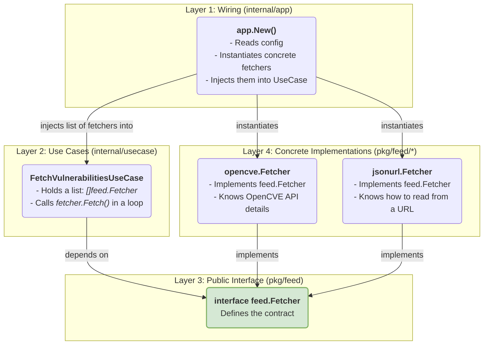

# Architecture Decision Record: Public Feed Package

**Status:** Proposed

**Context:**
Our application, VulnSense, needs to ingest vulnerability data from a variety of external sources (feeds). These sources can include public APIs like OpenCVE, NVD, or custom data sources delivered via JSON files over HTTP. As the number of supported sources grows, we need a consistent, scalable, and maintainable way to manage data fetching logic. The logic for fetching and parsing data from these sources could potentially be reused in other tools or services in the future.

**Decision:**
We will create a public-facing Go package located at `pkg/feed`. This package will define a common interface for all vulnerability data fetchers and provide concrete implementations for each supported data source.

By placing this in `pkg/`, we explicitly mark it as a library with a stable, public-facing API, suitable for use by external projects. This is in contrast to `internal/`, which is specific to the VulnSense application.

---

## 1. Core Interface

The core of the package is the `Fetcher` interface. It defines a "contract" that every data source provider must adhere to. This ensures that the application's use cases can interact with any data source in a uniform way.

**File:** `pkg/feed/fetcher.go`
```go
package feed

import (
    "context"
    "vulnsense/internal/domain" // Note: This dependency is acceptable
)

// Fetcher defines the standard interface for any vulnerability data source.
// It decouples the application's core logic from the specific implementation
// details of how data is retrieved from a particular source.
type Fetcher interface {
    // Fetch retrieves vulnerability data from the source.
    Fetch(ctx context.Context) ([]domain.Vulnerability, error)

    // SourceName returns a unique, human-readable identifier for the feed.
    // e.g., "OpenCVE", "NVD-API-v2".
    SourceName() string
}
```
> **Dependency Note:** It is acceptable for this public interface to depend on `internal/domain`. The domain entities (`Vulnerability`, `Asset`) are the core "language" of our entire system. For any component to be useful within the VulnSense ecosystem, it must speak this language.

---

## 2. Directory Structure

The package will be organized with a root directory for the core interface and sub-packages for each concrete implementation. This keeps the concerns of each source neatly separated.

```
pkg/
└── feed/
    ├── fetcher.go          # The core Fetcher interface definition.
    |
    ├── opencve/
    │   └── fetcher.go      # Implementation for the OpenCVE API.
    │
    ├── jsonurl/
    │   └── fetcher.go      # Implementation for a generic JSON URL feed.
    │
    └── nvd/                # Future implementation for NVD API.
        └── fetcher.go
```

---

## 3. Architecture and Data Flow

This design strictly adheres to the **Dependency Inversion Principle**, a cornerstone of Clean Architecture. The application's core (`usecase`) depends on an abstraction (`feed.Fetcher` interface), not on concrete implementations. The concrete implementations also depend on this abstraction, as they must implement it.

This "inverts" the natural flow of control, ensuring our core business logic is not polluted with external details.



### Execution Flow:

1.  **Initialization (`app.New`)**: The application starts. It reads the configuration to see which feeds are enabled (e.g., `sources.opencve.enabled: true`).
2.  **Instantiation**: For each enabled feed, `app.New` creates an instance of its concrete fetcher (e.g., `opencve.New(...)`).
3.  **Dependency Injection**: `app.New` collects all these instances into a single slice `[]feed.Fetcher`. It then passes this slice into the constructor of `FetchVulnerabilitiesUseCase`.
4.  **Execution (`FetchVulnerabilitiesUseCase.Execute`)**: When a background job triggers the use case, it doesn't know or care if it's talking to OpenCVE or a JSON file. It simply iterates over its slice of `Fetcher` interfaces and calls `Fetch()` on each one, aggregating the results.
5.  **Polymorphism in Action**: Each concrete `Fetcher` implements its own `Fetch()` method, containing the specific logic to connect to its data source, handle authentication, parse the data, and transform it into the standard `[]domain.Vulnerability` format. 