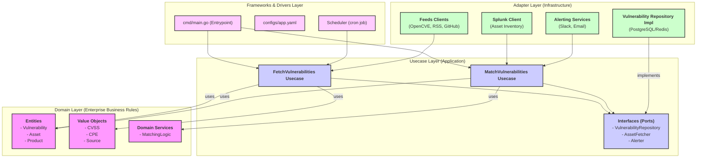
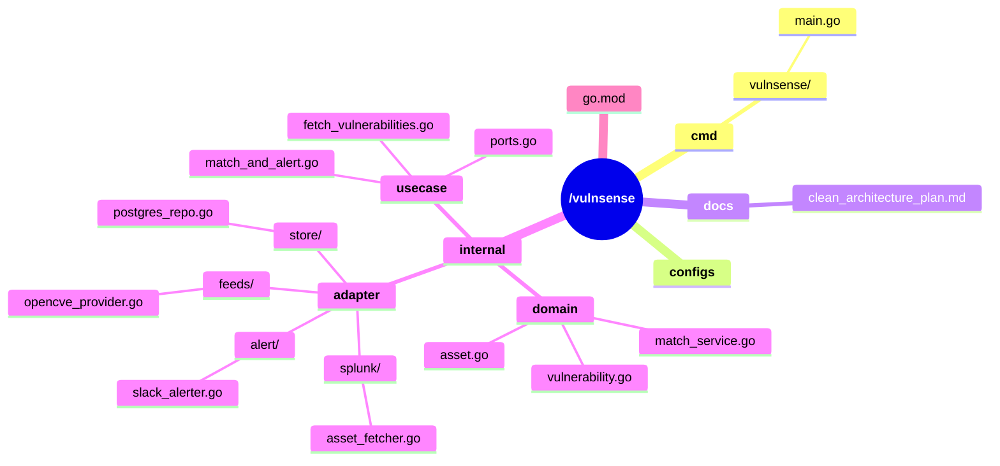

# Quy hoạch dự án VulnSense theo Clean Architecture và DDD

Dưới đây là định hướng chi tiết để quy hoạch lại dự án `vulnsense` theo Clean Architecture và Domain-Driven Design (DDD), tạo ra một "bản thiết kế" rõ ràng để triển khai dần.

## Nguyên tắc cốt lõi

Kiến trúc của chúng ta sẽ tuân thủ **Quy tắc Phụ thuộc (The Dependency Rule)**: Mọi sự phụ thuộc phải hướng vào trong.

- `Adapter` phụ thuộc vào `Usecase`.
- `Usecase` phụ thuộc vào `Domain`.
- `Domain` không phụ thuộc vào bất cứ thứ gì.

Điều này đảm bảo logic nghiệp vụ cốt lõi (domain) hoàn toàn độc lập với các chi tiết kỹ thuật bên ngoài (cơ sở dữ liệu, API, framework).

## Sơ đồ kiến trúc đề xuất

Đây là cách các thành phần của `vulnsense` sẽ được tổ chức trong kiến trúc mới:



## Cấu trúc thư mục được quy hoạch lại

Dựa trên sơ đồ trên, đây là cấu trúc thư mục mới mà chúng ta sẽ hướng tới. Cấu trúc cũ trong `pkg/` sẽ dần được chuyển vào đây.

```
/vulnsense
├── cmd/
│   └── vulnsense/
│       └── main.go         # Entrypoint: khởi tạo dependencies và chạy usecase
│
├── configs/
│
├── internal/
│   ├── domain/
│   │   ├── vulnerability.go  # Entity Vulnerability, Value Objects (CVSS, CPE...)
│   │   ├── asset.go          # Entity Asset
│   │   └── match_service.go  # Domain Service chứa logic so khớp thuần túy
│
│   ├── usecase/
│   │   ├── ports.go          # Định nghĩa các Interfaces (Ports)
│   │   │   // interface VulnerabilityRepository { Find(), Save(), ... }
│   │   │   // interface AssetFetcher { FetchAll() }
│   │   │   // interface Alerter { Notify() }
│   │   │   // interface FeedProvider { Fetch() }
│   │   │
│   │   ├── fetch_vulnerabilities.go  # Usecase: điều phối việc lấy dữ liệu từ các feeds
│   │   └── match_and_alert.go      # Usecase: điều phối việc so khớp và cảnh báo
│
│   └── adapter/
│       ├── store/
│       │   └── postgres_repo.go  # Triển khai VulnerabilityRepository dùng PostgreSQL
│       │
│       ├── feeds/
│       │   ├── opencve_provider.go # Triển khai FeedProvider cho OpenCVE
│       │   └── rss_provider.go     # Triển khai FeedProvider cho các nguồn RSS
│       │
│       ├── splunk/
│       │   └── asset_fetcher.go    # Triển khai AssetFetcher dùng Splunk API
│       │
│       └── alert/
│           ├── slack_alerter.go    # Triển khai Alerter gửi qua Slack
│           └── email_alerter.go    # Triển khai Alerter gửi qua Email
│
└── go.mod
```

## Phân tích chi tiết các lớp

### 1. Lớp `domain` (Trái tim của ứng dụng)
*   **Mục đích:** Chứa các quy tắc nghiệp vụ quan trọng nhất, không phụ thuộc vào bất kỳ công nghệ nào.
*   **Thành phần:**
    *   **Entities:** Các đối tượng có định danh và vòng đời, ví dụ: `Vulnerability`, `Asset`. `Vulnerability` là một *Aggregate Root* tuyệt vời.
    *   **Value Objects:** Các đối tượng được định nghĩa bởi thuộc tính của chúng, ví dụ: `CVSS`, `CPE`, `Source`. Chúng không có định danh riêng.
    *   **Domain Services:** Khi một logic nghiệp vụ phức tạp không thuộc về một entity cụ thể nào, ta tạo ra một Domain Service. Ví dụ: `MatchingLogic` chứa thuật toán thuần túy để so sánh một `Vulnerability` và một `Asset`.

### 2. Lớp `usecase` (Quy trình nghiệp vụ của ứng dụng)
*   **Mục đích:** Điều phối luồng dữ liệu để thực hiện một hành động cụ thể mà người dùng hoặc hệ thống muốn. Nó trả lời câu hỏi "Ứng dụng của chúng ta có thể làm gì?".
*   **Thành phần:**
    *   **Usecases:** Ví dụ: `FetchVulnerabilities`, `MatchAndAlert`. Mỗi usecase là một "câu chuyện", ví dụ: "Lấy tất cả các lỗ hổng từ các nguồn đã được cấu hình, chuẩn hóa chúng và lưu vào kho lưu trữ."
    *   **Ports (Interfaces):** Đây là phần cực kỳ quan trọng. Usecase định nghĩa các *hợp đồng* (interfaces) mà nó cần, ví dụ: "Tôi cần một thứ gì đó có thể lưu `Vulnerability` (một `VulnerabilityRepository`), nhưng tôi không quan tâm nó được lưu vào PostgreSQL, MongoDB hay file text."

### 3. Lớp `adapter` (Chi tiết kỹ thuật)
*   **Mục đích:** "Cắm" các công nghệ cụ thể vào các "cổng" (ports) đã được định nghĩa ở lớp `usecase`.
*   **Thành phần:**
    *   **Input Adapters (Driving Adapters):** Khởi xướng một usecase. Ví dụ: một `Scheduler` gọi `FetchVulnerabilities` usecase, hoặc một `API Handler` nhận request từ bên ngoài.
    *   **Output Adapters (Driven Adapters):** Triển khai các interfaces mà usecase cần. Ví dụ:
        *   `store/postgres_repo.go`: Triển khai `VulnerabilityRepository` bằng cách sử dụng GORM/sqlx để nói chuyện với PostgreSQL.
        *   `feeds/opencve_provider.go`: Triển khai `FeedProvider` bằng cách gọi API của OpenCVE.
        *   `splunk/asset_fetcher.go`: Triển khai `AssetFetcher` bằng cách gọi API của Splunk.

## Luồng thực thi ví dụ: "Tự động tìm và cảnh báo lỗ hổng mới"

1.  **Scheduler** (Adapter) kích hoạt.
2.  Nó gọi `FetchVulnerabilities` **Usecase**.
3.  Usecase này yêu cầu các `FeedProvider` (Adapter) lấy dữ liệu thô.
4.  Dữ liệu thô được chuyển đổi thành `Vulnerability` **Domain Entity**.
5.  Usecase sử dụng `VulnerabilityRepository` **Port** để lưu các entities này. `PostgresRepository` (Adapter) thực thi việc lưu vào DB.
6.  Scheduler sau đó gọi `MatchAndAlert` **Usecase**.
7.  Usecase này dùng `VulnerabilityRepository` và `AssetFetcher` **Ports** để lấy dữ liệu.
8.  Nó sử dụng `MatchingLogic` **Domain Service** để tìm các cặp khớp nhau.
9.  Với mỗi cặp tìm thấy, nó gọi `Alerter` **Port**. `SlackAlerter` (Adapter) nhận lệnh và gửi tin nhắn đi.

## Lợi ích của hướng đi này
*   **Khả năng thay thế (Pluggable):** Muốn đổi từ Splunk sang ServiceNow để quản lý tài sản? Chỉ cần viết một adapter mới `servicenow/asset_fetcher.go` và "cắm" nó vào lúc khởi tạo. Toàn bộ logic nghiệp vụ bên trong không cần thay đổi một dòng code nào.
*   **Khả năng kiểm thử (Testability):** Bạn có thể dễ dàng viết unit test cho toàn bộ logic nghiệp vụ bằng cách tạo ra các "mock" adapters trong bộ nhớ, không cần kết nối tới cơ sở dữ liệu hay API thật.
*   **Bảo trì dễ dàng:** Các lớp được phân tách rõ ràng. Khi có lỗi liên quan đến Slack, bạn biết chính xác cần xem tệp `slack_alerter.go`. Khi logic so khớp cần thay đổi, bạn vào `domain/match_service.go`.

---

## Lộ Trình Triển Khai Chi Tiết

Đây là lộ trình hành động được đề xuất, từng bước một, để xây dựng lại dự án theo kiến trúc mới. Lộ trình này tập trung vào việc xây dựng các lớp từ trong ra ngoài (từ `domain` đến `adapter`).

### Giai đoạn 1: Xây dựng nền móng (Lớp `domain`)

Đây là bước quan trọng nhất, định hình trái tim của ứng dụng.

*   **Bước 1: Tạo cấu trúc thư mục.**
    *   **Hành động:** Tạo các thư mục rỗng: `internal/domain`, `internal/usecase`, và `internal/adapter`.
    *   **Mục tiêu:** Chuẩn bị không gian làm việc theo đúng kiến trúc đã vạch ra.

*   **Bước 2: Định nghĩa `Vulnerability` Entity.**
    *   **Hành động:** Tạo tệp `internal/domain/vulnerability.go`.
    *   **Nội dung:** Định nghĩa struct `Vulnerability` dựa trên `UVF` trong tài liệu, chứa các trường cốt lõi như `ID`, `Source`, `Product`, `Version`, `CVSS`...
    *   **Nguyên tắc:** Tệp này chỉ chứa định nghĩa dữ liệu và các logic nghiệp vụ thuần túy (ví dụ: một phương thức `IsCritical()`). Tuyệt đối không có code về cơ sở dữ liệu, API, hay logging.

*   **Bước 3: Định nghĩa `Asset` Entity.**
    *   **Hành động:** Tạo tệp `internal/domain/asset.go`.
    *   **Nội dung:** Định nghĩa struct `Asset` với các trường như `Hostname`, `IPAddress`, `InstalledProducts`.

### Giai đoạn 2: Xây dựng các quy trình (Lớp `usecase`)

Lớp này định nghĩa "ứng dụng của chúng ta có thể làm gì" và các cổng giao tiếp (ports).

*   **Bước 4: Định nghĩa các "Cổng" (Ports/Interfaces).**
    *   **Hành động:** Tạo tệp `internal/usecase/ports.go`.
    *   **Nội dung:** Định nghĩa các `interface` mà các use case sẽ cần:
        *   `VulnerabilityRepository`: Định nghĩa các hành động như `Save(Vulnerability)`, `FindByID(string)`.
        *   `FeedProvider`: Định nghĩa một hành động `Fetch()`.
        *   `AssetFetcher`: Định nghĩa hành động `FetchAll()`.
        *   `Alerter`: Định nghĩa hành động `Notify(message)`.

*   **Bước 5: Viết Usecase đầu tiên: `FetchVulnerabilities`.**
    *   **Hành động:** Tạo tệp `internal/usecase/fetch_vulnerabilities.go`.
    *   **Nội dung:** Tạo struct `FetchVulnerabilitiesUsecase`. Struct này sẽ nhận các `FeedProvider` và `VulnerabilityRepository` (qua interface) làm phụ thuộc. Phương thức `Execute()` của nó sẽ điều phối luồng lấy dữ liệu, chuẩn hóa và lưu trữ.

### Giai đoạn 3: Lắp đặt các thiết bị (Lớp `adapter`)

Đây là lúc chúng ta kết nối các công nghệ cụ thể vào các "cổng" đã định nghĩa.

*   **Bước 6: Tạo Adapter đầu tiên cho Feed: `OpenCVE`.**
    *   **Hành động:** Tạo tệp `internal/adapter/feeds/opencve_provider.go`.
    *   **Nội dung:** Tạo struct `OpenCVEProvider` và triển khai `interface FeedProvider` cho nó. Phương thức `Fetch()` sẽ chứa code thực tế để gọi API của OpenCVE.

*   **Bước 7: Tạo Adapter cho Kho lưu trữ: Bắt đầu với In-Memory.**
    *   **Hành động:** Tạo tệp `internal/adapter/store/memory_repo.go`.
    *   **Nội dung:** Tạo struct `InMemoryVulnerabilityRepository` và triển khai `interface VulnerabilityRepository` bằng cách sử dụng `map` hoặc `slice` trong bộ nhớ.
    *   **Mục tiêu:** Giúp chạy và kiểm thử usecase mà không cần phải cài đặt cơ sở dữ liệu thật ngay lập tức.

### Giai đoạn 4: Khởi động hệ thống (`cmd/main.go`)

*   **Bước 8: Kết nối mọi thứ lại với nhau (Dependency Injection).**
    *   **Hành động:** Chỉnh sửa tệp `cmd/vulnsense/main.go`.
    *   **Logic:**
        1.  Tạo một instance của `InMemoryVulnerabilityRepository` (adapter).
        2.  Tạo một instance của `OpenCVEProvider` (adapter).
        3.  Tạo một instance của `FetchVulnerabilitiesUsecase`, truyền hai instance adapter trên vào constructor của nó.
        4.  Gọi `usecase.Execute()`.

---

## Sơ đồ cấu trúc thư mục mục tiêu

Đây là sơ đồ trực quan về cấu trúc thư mục mục tiêu sau khi tái cấu trúc, giúp dễ dàng hình dung vị trí của từng thành phần.



### Cấu trúc thư mục dạng văn bản

Dưới đây là cấu trúc thư mục mục tiêu được trình bày dưới dạng cây thư mục bằng văn bản để cung cấp một cái nhìn chi tiết và rõ ràng.

```
vulnsense/
├── cmd/
│   └── vulnsense/
│       └── main.go              # Điểm khởi chạy, nơi lắp ráp các dependencies
├── configs/                     # Chứa các tệp cấu hình (ví dụ: app.yaml)
├── docs/
│   └── clean_architecture_plan.md # Tài liệu kiến trúc và kế hoạch
├── internal/
│   ├── domain/                  # ❤️ LỚP DOMAIN: Logic nghiệp vụ cốt lõi
│   │   ├── vulnerability.go     #   - Entity: Vulnerability
│   │   ├── asset.go             #   - Entity: Asset
│   │   └── match_service.go     #   - Domain Service: Logic so khớp
│   │
│   ├── usecase/                 # ⚙️ LỚP USECASE: Các quy trình nghiệp vụ
│   │   ├── ports.go             #   - Định nghĩa các "cổng" (interfaces)
│   │   ├── fetch_vulnerabilities.go #   - Usecase: Lấy và lưu lỗ hổng
│   │   └── match_and_alert.go   #   - Usecase: So khớp và cảnh báo
│   │
│   └── adapter/                 # 🏢 LỚP ADAPTER: Giao tiếp với bên ngoài
│       ├── store/               #   - Adapter cho lưu trữ
│       │   └── postgres_repo.go
│       ├── feeds/               #   - Adapter cho các nguồn cấp dữ liệu
│       │   └── opencve_provider.go
│       ├── splunk/              #   - Adapter cho việc lấy tài sản
│       │   └── asset_fetcher.go
│       └── alert/               #   - Adapter cho việc gửi cảnh báo
│           └── slack_alerter.go
│
├── go.mod
└── go.sum
```

---

## Đối chiếu với các tiêu chuẩn cộng đồng

Phần này cung cấp sự so sánh giữa kiến trúc đã được hoạch định cho `vulnsense` và hai tài liệu tham khảo tiêu chuẩn phổ biến trong cộng đồng Go để chứng minh sự tuân thủ và tính hợp lý của các quyết định thiết kế.

### 1. So sánh với `golang-standards/project-layout`

*Repo tham khảo: [@https://github.com/golang-standards/project-layout](https://github.com/golang-standards/project-layout)*

**Kết luận:** Cấu trúc của chúng ta **tuân thủ rất chặt chẽ** và **áp dụng đúng tinh thần** của `golang-standards/project-layout`.

| Thư mục theo chuẩn | Mục đích theo chuẩn | Cách chúng ta áp dụng | Mức độ tương thích |
| :--- | :--- | :--- | :--- |
| **`/cmd`** | Chứa các ứng dụng chính (main applications). | Đặt `main.go` trong `cmd/vulnsense/`. | ✅ **Hoàn toàn tương thích** |
| **`/internal`** | Chứa code private của ứng dụng, được Go compiler bảo vệ. | Đặt toàn bộ kiến trúc (`domain`, `usecase`, `adapter`) vào đây để bảo vệ logic nghiệp vụ. | ✅ **Hoàn toàn tương thích và đúng tinh thần** |
| **`/pkg`** | Chứa code public (thư viện) cho các ứng dụng bên ngoài sử dụng. | **Chủ động không sử dụng**, vì code của `vulnsense` là code nghiệp vụ, không phải thư viện. | ✅ **Hoàn toàn tương thích (bằng cách không dùng)** |
| **`/configs`** | Chứa các tệp cấu hình. | Giữ nguyên thư mục `configs/`. | ✅ **Hoàn toàn tương thích** |
| **`/docs`** | Chứa tài liệu của dự án. | Sử dụng `docs/` để lưu trữ tài liệu thiết kế. | ✅ **Hoàn toàn tương thích** |

**Phân tích sâu hơn:**
*   **Sử dụng `/internal` để bảo vệ Clean Architecture:** Chúng ta tận dụng cơ chế của Go compiler để thực thi các quy tắc của Clean Architecture, đảm bảo logic nghiệp vụ không bị rò rỉ ra bên ngoài.
*   **Bỏ qua `/pkg` một cách có chủ đích:** Vì `vulnsense` là một ứng dụng chứ không phải một thư viện công khai, việc đặt tất cả code vào `internal` là quyết định thiết kế chính xác nhất theo định nghĩa của `project-layout`.

### 2. So sánh với `evrone/go-clean-template`

*Repo tham khảo: [@https://github.com/evrone/go-clean-template](https://github.com/evrone/go-clean-template)*

**Kết luận:** Kiến trúc của chúng ta **hoàn toàn tương đồng về mặt triết lý** và các nguyên tắc cốt lõi. Sự khác biệt nằm ở cách tổ chức thư mục chi tiết, nơi kế hoạch của chúng ta được "tối giản hóa" để phù hợp với `vulnsense`.

**Điểm tương đồng cốt lõi:**
*   **Clean Architecture:** Cả hai đều tuân thủ nghiêm ngặt Quy tắc Phụ thuộc.
*   **Dependency Injection:** Cả hai đều sử dụng constructor injection để loại bỏ sự phụ thuộc vào các triển khai cụ thể.
*   **Sử dụng `/internal`:** Cả hai đều đặt toàn bộ code ứng dụng vào `/internal`.

**So sánh chi tiết về cấu trúc:**

| Thành phần | `evrone/go-clean-template` | Kế hoạch của chúng ta | Phân tích và Giải thích |
| :--- | :--- | :--- | :--- |
| **Lớp Domain** | `internal/entity` | `internal/domain` | **Tương đồng.** Chúng ta chọn `domain` vì nó bao hàm ý nghĩa rộng hơn của DDD (Entities, Value Objects, Domain Services). |
| **Lớp Usecase** | `internal/usecase` | `internal/usecase` | ✅ **Giống hệt nhau.** |
| **Lớp Adapter** | `internal/controller/` (input)<br>`internal/repo/` (output) | `internal/adapter/` | **Khác nhau về cách gom nhóm.** Kế hoạch của chúng ta gom tất cả adapters vào một nơi để nhấn mạnh vai trò kiến trúc chung của chúng: là cầu nối với thế giới bên ngoài. |
| **Interfaces (Ports)**| Nằm rải rác trong các gói `usecase` hoặc `repo`. | `internal/usecase/ports.go` | **Khác nhau về vị trí.** Kế hoạch của chúng ta gom các "cổng" chính vào một tệp duy nhất để tạo ra một "bảng mục lục" rõ ràng về các ranh giới của ứng dụng. |

**Đánh giá:**
*   `evrone/go-clean-template` là một template đầy đủ, phức tạp, sẵn sàng cho nhiều loại giao tiếp (REST, gRPC, AMQP).
*   Kế hoạch của chúng ta là một phiên bản "tối giản" và "tập trung" hơn, áp dụng chính xác các nguyên tắc tương tự nhưng chỉ xây dựng những gì cần thiết cho `vulnsense`, tránh sự phức tạp không cần thiết ở giai đoạn này. 

---

## Đề xuất về Công nghệ (Tech Stack)

Việc lựa chọn công nghệ phù hợp là yếu tố quan trọng quyết định hiệu suất, khả năng mở rộng và chi phí vận hành của dự án. Dưới đây là đề xuất về một bộ công nghệ hiện đại, mạnh mẽ và phù hợp cho `vulnsense`, được thiết kế để dễ dàng tích hợp vào kiến trúc đã chọn.

### Tóm tắt đề xuất

| Thành phần | Công nghệ đề xuất | Lý do chính |
| :--- | :--- | :--- |
| **Database** | **PostgreSQL** | Dữ liệu có cấu trúc, ổn định, hỗ trợ JSONB mạnh mẽ, dễ dàng mở rộng. |
| **Cache** | **Redis** | Tốc độ cực nhanh, giảm tải cho Database và API, có nhiều cấu trúc dữ liệu hữu ích. |
| **Lập lịch (Scheduler)** | Thư viện Go (ví dụ: **robfig/cron**) | Giữ ứng dụng độc lập, không phụ thuộc vào `crontab` của hệ điều hành, dễ deploy. |
| **Cấu hình (Config)**| Thư viện Go (ví dụ: **Viper**) + tệp YAML | Linh hoạt, hỗ trợ nhiều nguồn (tệp, biến môi trường), dễ đọc. |
| **Ghi Log (Logging)** | Thư viện chuẩn **slog** (Go 1.21+) | Cấu trúc hóa (JSON), hiệu năng cao, là tiêu chuẩn mới của Go. |

### Phân tích chi tiết

#### 1. Cơ sở dữ liệu (Database)
**Đề xuất: PostgreSQL**
*   **Lý do:** Dữ liệu của `Vulnerability` và `Asset` có cấu trúc rõ ràng, phù hợp với mô hình quan hệ. PostgreSQL cung cấp khả năng truy vấn mạnh mẽ (JOIN, phức tạp WHERE) và hỗ trợ kiểu dữ liệu `JSONB` linh hoạt cho các trường như `references`. Đây là một lựa chọn cực kỳ tin cậy và ổn định cho môi trường production.
*   **Tích hợp vào kiến trúc:** Tạo một `adapter` trong `internal/adapter/store/postgres_repo.go` để triển khai `interface VulnerabilityRepository` sử dụng thư viện như `sqlx` hoặc `pgx`.

#### 2. Cache
**Đề xuất: Redis**
*   **Lý do:** Tốc độ truy cập trong bộ nhớ cực nhanh của Redis giúp giảm tải đáng kể cho cả cơ sở dữ liệu và các API bên ngoài (Splunk, RSS feeds), tránh bị giới hạn tốc độ (rate limiting).
*   **Tích hợp vào kiến trúc:** `Adapter` lưu trữ có thể là một "Composite Adapter", kết hợp cả Redis và PostgreSQL. Logic sẽ là: kiểm tra Redis trước (cache hit), nếu không có thì mới truy vấn PostgreSQL (cache miss), sau đó cập nhật lại cache Redis.

#### 3. Lập lịch tác vụ (Scheduler)
**Đề xuất: Thư viện Go (ví dụ: `robfig/cron`)**
*   **Lý do:** Giúp ứng dụng tự vận hành mà không cần phụ thuộc vào `crontab` của hệ điều hành, làm cho việc triển khai bằng Docker trở nên đơn giản. Toàn bộ logic lập lịch được quản lý tập trung trong code.
*   **Tích hợp vào kiến trúc:** Scheduler được coi là một **Input Adapter**. Trong `main.go`, nó sẽ được khởi tạo và cấu hình để gọi các phương thức `Execute()` của các `usecase` theo lịch trình.

---

## Quản lý Cấu hình (Configuration Management)

Dự án sử dụng một chiến lược cấu hình kết hợp hai tệp để đạt được sự linh hoạt, bảo mật và minh bạch:

1.  **Tệp `.env`**: Dành cho Môi trường và Bí mật (Environment & Secrets).
2.  **Tệp `configs/app.yaml`**: Dành cho Hành vi Ứng dụng (Application Behavior).

### Nguyên tắc cốt lõi: Tách biệt mối quan tâm

#### 1. `.env` (Environment & Secrets)
*   **Mục đích**: Chứa các giá trị thay đổi giữa các môi trường (development, staging, production) và các thông tin nhạy cảm (secrets).
*   **Ví dụ**: `DB_PASSWORD`, `SPLUNK_TOKEN`, `SLACK_WEBHOOK_URL`, `DB_HOST`.
*   **Quy tắc**:
    *   **KHÔNG BAO GIỜ** được commit vào Git. Tệp này được liệt kê trong `.gitignore`.
    *   Được cung cấp bởi người vận hành (DevOps) hoặc hệ thống CI/CD tại thời điểm triển khai.
    *   Mỗi lập trình viên tạo tệp `.env` của riêng mình từ tệp mẫu `configs/app.env.example`.

#### 2. `configs/app.yaml` (Application Behavior)
*   **Mục đích**: Chứa các tham số định nghĩa cách ứng dụng hoạt động, các giá trị mặc định, và các cờ bật/tắt tính năng.
*   **Ví dụ**: Lịch trình chạy cron job, ngưỡng điểm cho việc so khớp, mức độ ghi log mặc định.
*   **Quy tắc**:
    *   **LUÔN LUÔN** được commit vào Git. Các thay đổi trong tệp này là một phần của logic ứng dụng và cần được review.
    *   Thường không thay đổi giữa các môi trường.

### Luồng thực thi
Chúng ta sẽ sử dụng một thư viện quản lý cấu hình (ví dụ: Viper) để triển khai chiến lược này:
1.  **Đọc tệp `configs/app.yaml`** để tải các giá trị cấu hình hành vi mặc định.
2.  **Đọc các biến môi trường**. Các biến này có thể được nạp tự động từ tệp `.env` bởi Docker Compose hoặc được cung cấp trực tiếp trong môi trường production.
3.  **Ghi đè (Override)**: Các giá trị từ biến môi trường sẽ được ưu tiên và ghi đè lên các giá trị tương ứng đã được đọc từ tệp YAML.

Cách tiếp cận này mang lại sự cân bằng hoàn hảo: các cấu hình quan trọng về hành vi được quản lý phiên bản cùng với mã nguồn, trong khi các bí mật và cấu hình môi trường vẫn được giữ an toàn và linh hoạt.